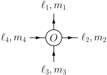

Introduction
============

A note.

.. note::

   Something to be noted.

A warning

.. warning::

   Something to be wary of.

A reference

.. seealso::

   Something that should also be seen.

A matlab code block.

.. code-block:: matlab

   function output = myFunction(input)
       output = input;
   end

A python code block.

.. code-block:: python

   pip install myst-parser
   extensions = ['myst_parser']

A snippet: ``code-snippet``, `other-code-snippet`

A command prompt block.

.. prompt:: bash $

   cd docs/
   make html

A button: :guilabel:`member`.

Section 1
---------

Testing math: :math:`x_{hey}=it+is^{math}`

Testing equation:

.. math::
   e^{i\pi} + 1 = 0
   :label: euler

This is the best equation :eq:`euler`

Testing more equations:

.. math::
   \mathcal{Z} = \left (\prod_{i} \int \frac{\text{d}\Omega_i}{4\pi}\right ) \left (\prod_{\braket{ij}} \text{e}^{\beta\left(\vec{s}_i \cdot \vec{s}_j\right)^p}\right ).
   :label: eqn:best

This is the best equation :eq:`eqn:best`

Section 2
---------

Testing ipe images: should be imported as .svg

   

   

